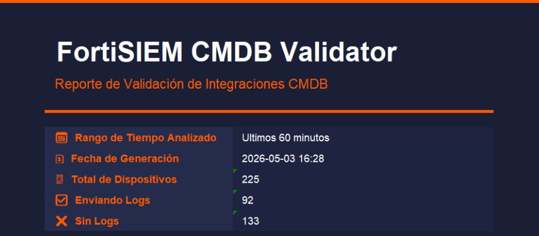
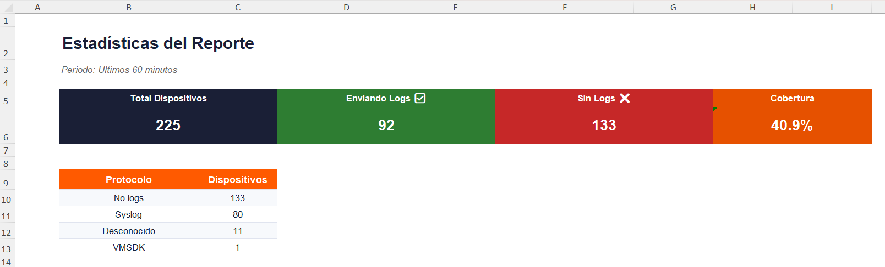
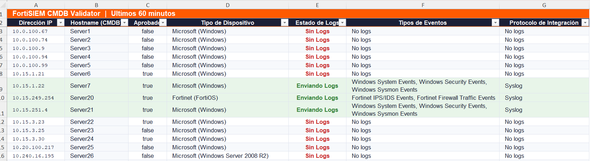

# FortiSIEM CMDB Validator


Este programa utiliza la API de FortiSIEM para extrare y analizar informacion sobre los equipos integrados en la CMDB.

## Caracteristicas:
- Metricas de cobertura de equipos que envian Logs al SIEM.
- Analisis de equipos que envian y no envian eventos.
- Analisis de metodos de integracion y tipos de auditorias.
- Extraer equipos que no envian eventos por un tiempo determinado por el usuario.
- Extraer todos los equipos de la CMDB de FortiSIEM y mostrar si han enviado eventos o no en un rango de tiempo.

## Instalacion
1. Descargar repositorio desde la web o mediante git clone:
``` bash
git clone https://github.com/starydarkz/Fortisiem_CMDB_Validator.git
cd Fortisiem_CMDB_Validator
pip3 install -r requeriments.txt
```

## Uso
``` bash
python3 fsmcmdbval.py [options]
```

``` bash
  -h, --help            show this help message and exit
  -u, --user USER       Set User account
  -p, --passw PASSW     Set Password account
  -s, --siem SIEM       Set IP FortiSiEM Supervisor IP
  -o, --output OUTPUT   Set output file path
  -t, --time TIME       Set time range logs
  -xall, --extractall   Extraer la CMDB y toda la informacion relacionadas
```

## Ejemplos:

Extrae toda la informacion del a CMDB:

```python3 fsmcmdbval.py -u super/usuario -p Password -s 127.0.0.1 -o file.xlsx -xall```




